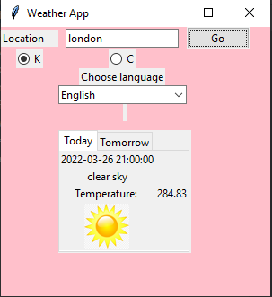

# Weather App

This application gets today and tomorrow's weather from
[openweathermap](https://openweathermap.org/api) REST API.

city.list.json can be downloaded from [here](https://bulk.openweathermap.org/sample/city.list.json.gz)

Tkinter was used for the UI.

